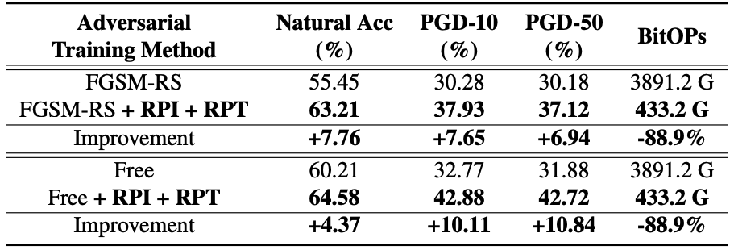

# Double-Win Quant: Aggressively Winning Robustness of Quantized DeepNeural Networks via Random Precision Training and Inference

***Yonggan Fu***, Qixuan Yu, Meng Li, Vikas Chandra, Yingyan Lin

Accepted at ICML 2021 [[Paper Link]](http://proceedings.mlr.press/v139/fu21c.html).

## Overview
Quantization is promising in enabling powerful yet complex deep neural networks (DNNs) to be deployed into resource constrained platforms. However, quantized DNNs are vulnerable to adversarial attacks unless being equipped with sophisticated techniques, leading to a dilemma of struggling between DNNs' efficiency and robustness. In this work, we demonstrate a new perspective regarding quantization's role in DNNs' robustness, advocating that quantization can be leveraged to largely boost DNNs’ robustness, and propose a framework dubbed ***Double-Win Quant (DWQ)*** that can boost the robustness of quantized DNNs over their full precision counterparts by a large margin.

## Key Observations
We for the first time identify the poor adversarial transferability between different precisions of an adversarially trained model, i.e., when an adversarially trained model is quantized to different precisions in a post-training manner, the associated adversarial attacks transfer poorly between different precisions.

<p align="center">
  
</p>

## Method
Leveraging the poor adverarial transferability between precisions, we propose two simple but effective techniques to robustify the models.

- **Vanilla DWQ** - **Random Precision Inference (RPI)**: Given an adversarially trained model, RPI randomly selects one precision from an inference precisionset to quantize the model’s weights and activations duringinference.

<p align="center">
  
</p>

- **Enhanced DWQ** - **Random Precision Training (RPT)**: RPT adversarially trains a model from scratch via randomly selecting a precision from a candidate set in each iteration for generating adversarial examples and updating the model with the selected precision, while equipping the model with switchable batch normalization to independently record the statistics of different precisions.

<p align="center">
  
</p>

## Experimental Results

- Results of PGD attacks on CIFAR-10:

<p align="center">
  
</p>

- Results of PGD attacks on CIFAR-100:

<p align="center">
  
</p>

- Results of PGD attacks on ImageNet:

<p align="center">
  
</p>

- Results of Auto-Attack/CW/Bandits attacks on CIFAR-10:

<p align="center">
  
</p>


## Code Usage
The RPI and RPT techniques for CIFAR-10/100 and ImageNet are in `CIFAR` and `ImageNet`, respectively.


### Prerequisites
See `env.yml` for the complete conda environment. Create a new conda environment:
```
conda env create -f env.yml
conda activate pytorch
```

### Training and evaluation on CIFAR-10/100

The training codes are in `train.py`. `test_pgd.py` includes the test codes for evaluating pretrained models with PGD attacks and the test codes other types of attacks can be found in `test_strong.py` and `test_bandit.py`.

- To train a PreActResNet18 with RPT (precision set: 4~16-bit) on top of PGD-7 training on CIFAR-10:
```
python train.py --network PreActResNet18 --attack_type pgd --random_precision_training --num_bits_schedule 4 16 --switchable_bn --save_dir exp_preresnet18_pgd
```

- To evaluate a pretrained model with variants of PGD attacks:
```
python test_pgd.py --dataset cifar10 --network PreActResNet18 --switchable_bn --epsilon 8 --num_bits_list 4 5 6 7 8 9 10 11 12 13 14 15 16 --pretrain ckpt-to-pretrained-model
```

- To evaluate a pretrained model with [Auto-Attack](https://arxiv.org/abs/2003.01690):
```
python test_strong.py --dataset cifar10 --network PreActResNet18 --switchable_bn --epsilon 8 --attack_type auto_attack --num_bits_list 4 5 6 7 8 9 10 11 12 13 14 15 16 --pretrain ckpt-to-pretrained-model
```

### Training and evaluation on ImageNet

- To train a ResNet-50 with RPT on top of [Free-Adversarial-Training](https://arxiv.org/abs/1904.12843) on ImageNet:

```
python main.py --data path-to-imagenet --random_precision_training --num_bits_schedule 4 16 --switchable_bn --clip_eps 4 --fgsm_step 4 --defense_method free --batch_size 512 --lr 0.02 --automatic_resume --pretrained --epochs 60 --output_prefix exp_resnet50_free
```

- To train a ResNet-50 with RPT on top of [Fast-Adversarial-Training](https://arxiv.org/abs/2001.03994) on ImageNet:

```
python main.py --data path_to_imagenet --random_precision_training --num_bits_schedule 4 16 --switchable_bn --clip_eps 4 --fgsm_step 5 --defense_method random --batch_size 512 --lr 0.02 --automatic_resume --pretrained --epochs 60 --output_prefix exp_resnet50_fast
```

## Pretrained models

Pretrained models are provided in [google-drive](https://drive.google.com/drive/folders/1I27zanwgXa8vyyBIxB4OF8qrAVXc4OgP?usp=sharing), including PreActResNet18/WideResNet32 on CIFAR-10/100/SVHN trained by DWQ + PGD-7 and ResNet-50 on ImageNet trained by DWQ + [Free-Adversarial-Training](https://arxiv.org/abs/1904.12843)/[Fast-Adversarial-Training](https://arxiv.org/abs/2001.03994).


## Citation
```
@inproceedings{fu2021double,
  title={Double-Win Quant: Aggressively Winning Robustness of Quantized Deep Neural Networks via Random Precision Training and Inference},
  author={Fu, Yonggan and Yu, Qixuan and Li, Meng and Chandra, Vikas and Lin, Yingyan},
  booktitle={International Conference on Machine Learning},
  pages={3492--3504},
  year={2021},
  organization={PMLR}
}
```

## Acknowledgement

Our codes are modified from [Fast-Adversarial-Training](https://github.com/locuslab/fast_adversarial) and [Free-Adversarial-Training](https://github.com/mahyarnajibi/FreeAdversarialTraining).


